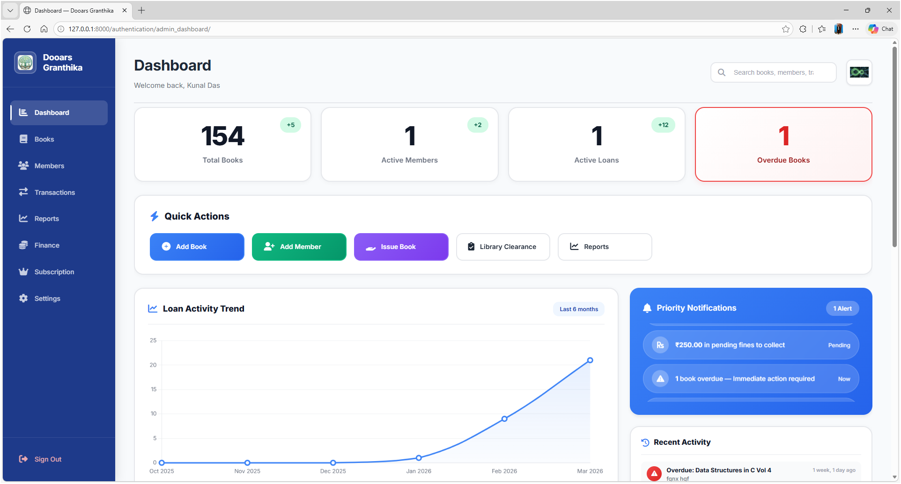
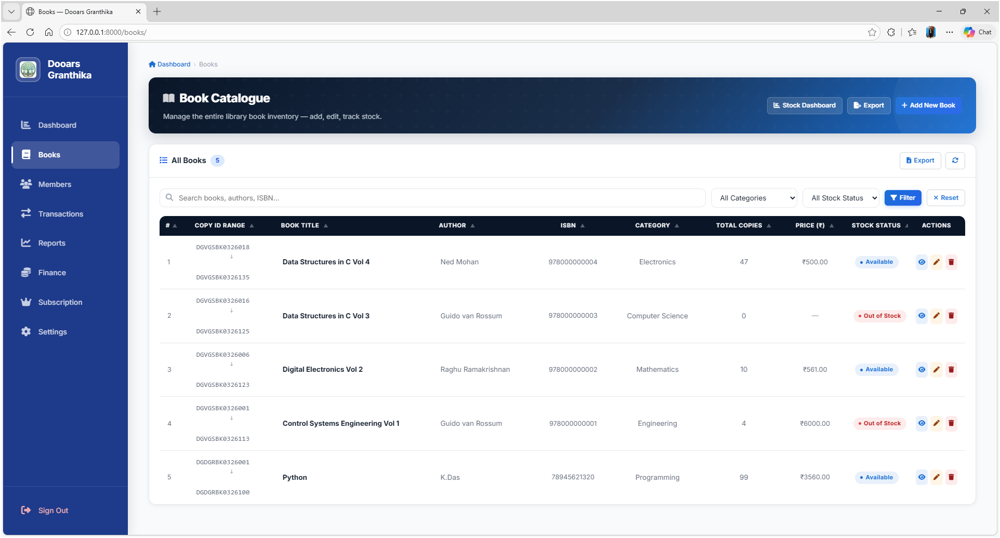
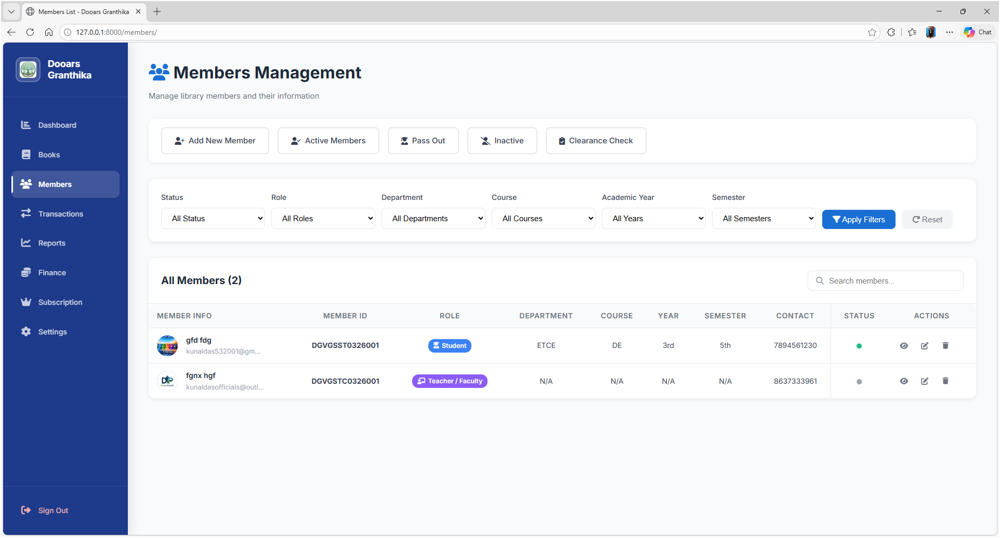
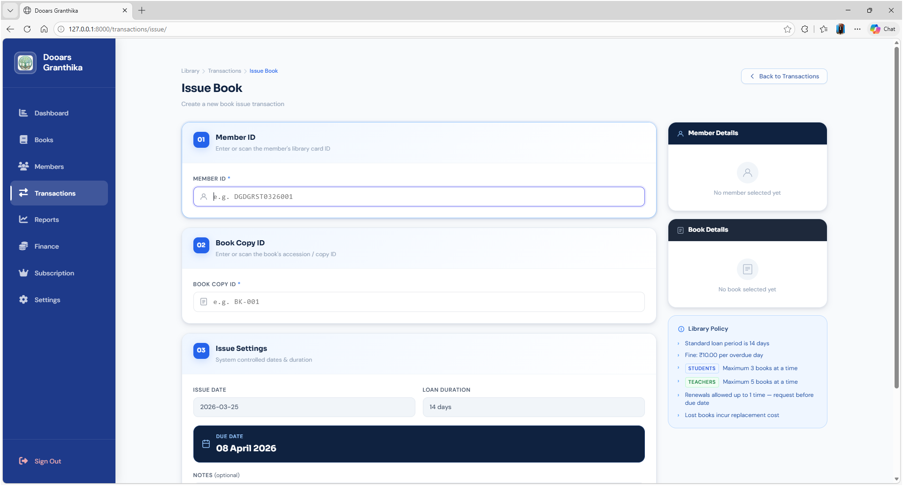
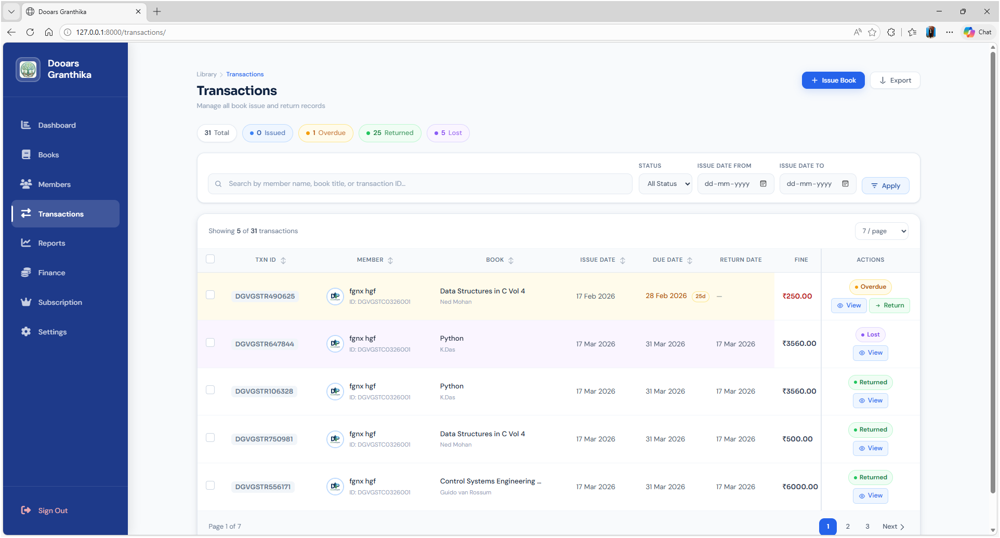
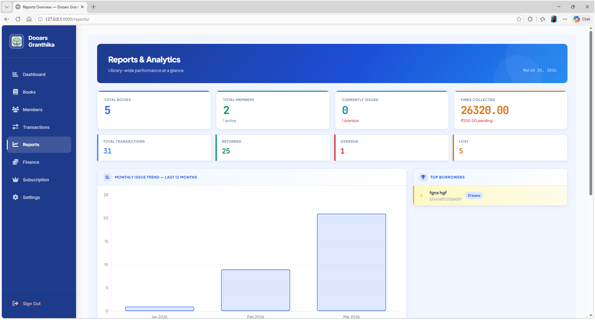
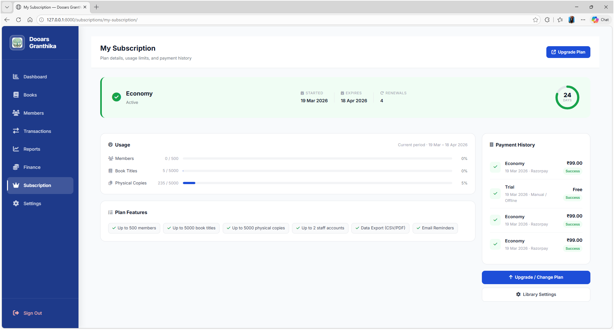
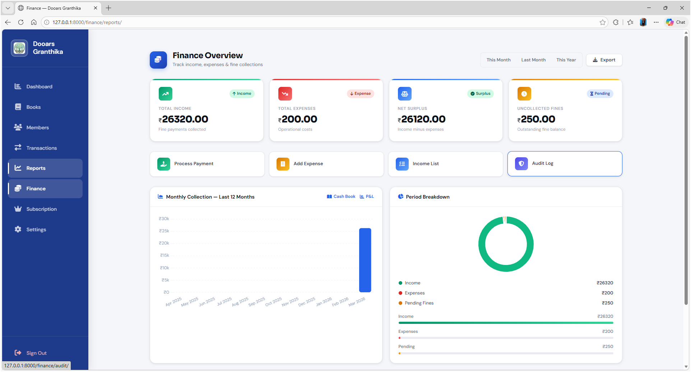
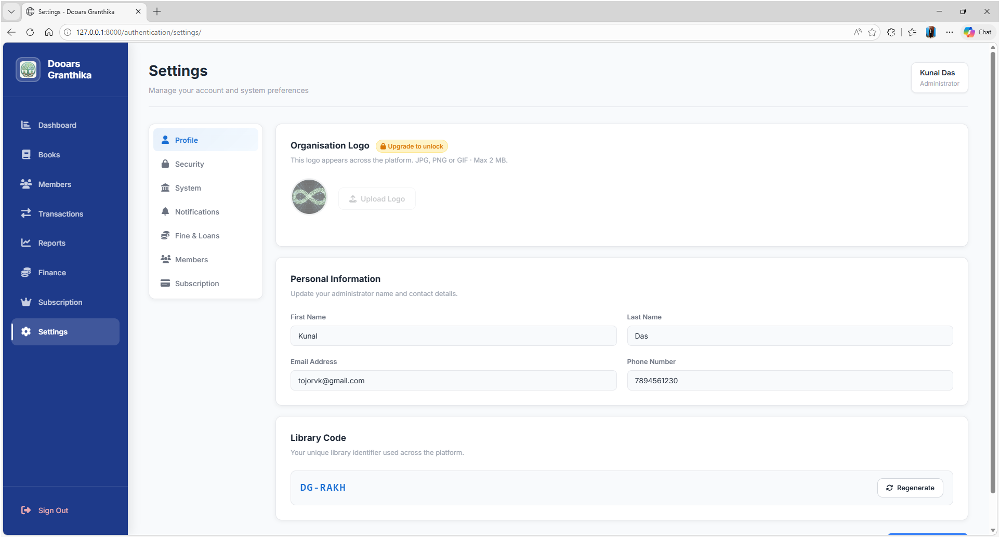

# 📚 Dooars Granthika — Library Management System

A multi-tenant, SaaS-ready Library Management System built with **Django 6.0.2**, designed for institutional, government-rural, and government-urban libraries. Each library operates in a fully isolated environment with its own configurable rules, member roles, fine policies, and subscription plan.


---

## 📸 Screenshots

| Dashboard | Book Catalogue | Members Management |
|-----------|----------------|----------------|
| ** | ** | ** |

| Issue Book | Transactions | Reports |
|------------|-----------------|---------|
| ** | ** | ** |

| Subscription | Finance Overview | Settings |
|------------|-----------------|---------|
| ** | ** | ** |
---

## 🚀 Features at a Glance

| Module | Highlights |
|---|---|
| 🏛 Library Management | Multi-tenant, onboarding wizard, auto-generated library codes |
| 📖 Book Catalogue | ISBN tracking, cover images, multi-language, Excel import/export |
| 📦 Copy Tracking | Physical copy IDs, borrow/return lifecycle, stock dashboard |
| 🧑‍🎓 Members | Student / Teacher / General roles, photo, clearance workflow |
| 📤 Transactions | Issue, return, renew, lost-book marking, full audit trail |
| 💰 Fines | Auto-calculated, background sync, payment tracking |
| 📊 Reports | 13 tenant-scoped report functions, CSV/Excel export |
| 📜 Clearance PDF | ReportLab-generated clearance certificate per member |
| 📧 Notifications | 19 email events + WhatsApp Business mirroring |
| 💳 Subscriptions | Basic → Enterprise plans, 30-day trial, SaaS superuser panel |

---

## 🔄 Core Workflows

### 1. Library Registration & Onboarding

When a new library signs up, the system walks through a structured onboarding flow before the dashboard becomes accessible.

```
Visit /authentication/sign_up/
        │
        ▼
Fill registration form
(library name, institute type, email, address)
        │
        ▼
Account created → credentials emailed automatically
        │
        ▼
First login → redirected to /authentication/library_setup/
        │
        ├── Step 1: Configure borrowing rules (fine rate, loan period, grace period)
        ├── Step 2: Set member borrow limits (student / teacher / general)
        ├── Step 3: Choose timezone and working days
        └── Step 4: Setup complete → Dashboard unlocked
```

A unique library code (`DG-XXXX`) is auto-generated at registration and can be regenerated via AJAX from the setup page. All settings sub-records — rules, member config, security, notifications, appearance, and subscription — are created automatically the moment the library account is saved.

---

### 2. Book Issue Workflow

```
Staff opens Issue Book page
        │
        ▼
Search member by name / ID  (AJAX autocomplete)
        │
        ▼
Search book by title / ISBN  (AJAX autocomplete)
        │
        ▼
System checks:
  ├── Is member active? (not blocked / expired)
  ├── Is member within borrow limit for their role?
  └── Is an available copy of this book in stock?
        │
        ▼  (all checks pass)
Select a specific physical copy
(auto-selected if only one available)
        │
        ▼
Confirm issue date → Transaction record created
  • Copy status flipped to Borrowed
  • Transaction ID auto-generated (e.g. DGDOOTR2648392071)
  • Fine rate snapshotted from current library rules
        │
        ▼
Email + WhatsApp notification sent to member
```

---

### 3. Book Return Workflow

```
Staff searches for the transaction
(by member name, member ID, or book title)
        │
        ▼
Select return condition: Good / Fair / Damaged / Lost
        │
        ▼
System calculates fine:

  effective_days = max(0, overdue_days − grace_period)
  fine = (effective_days × fine_rate) + damage_charge

        │
        ├── Fine = ₹0 ──────────────────────────────────────────────────┐
        │                                                                │
        └── Fine > ₹0                                                   │
              │                                                          │
              ├── Collect now? ─── Fine marked Paid immediately ────────┤
              │                                                          │
              └── Collect later ── Fine row saved as Unpaid             │
                                   (picked up by fine sync daemon)      │
                                                                        ▼
                                               Copy status → Available
                                               Transaction → Returned / Overdue Settled
                                               Email + WhatsApp sent to member
```

---

### 4. Fine Sync Daemon (Background Process)

A background thread starts automatically when the server boots and runs every 60 seconds across all libraries on the platform.

```
Every 60 seconds (for each library):
        │
        ├── Step 1 — Flip statuses
        │     Any issued transaction whose due date has passed
        │     → status updated to Overdue
        │
        ├── Step 2 — Upsert Fine rows  (skipped if auto_fine = OFF)
        │     For every Overdue or Issued transaction:
        │       effective_days = max(0, overdue_days − grace_period)
        │       amount = effective_days × live_fine_rate
        │       → Create Fine(TYPE_OVERDUE) if not exists
        │       → Update amount if Fine already exists and is Unpaid
        │       → Create Fine(TYPE_DAMAGE) if damage_charge > 0
        │
        ├── Step 3 — Auto-block members
        │     Any active member with ≥ 1 overdue loan
        │     → member status set to Blocked
        │
        ├── Step 4 — Auto-mark lost  (only if toggle ON in library rules)
        │     Transactions overdue > 60 days
        │     → status set to Lost
        │     → MissingBook record created
        │     → Fine(TYPE_LOST) created if auto_fine is also ON
        │
        └── Step 5 — Daily reminder emails
              Runs only between 11:00 AM – 11:00 PM, once per library per day
              Groups all unpaid fines by member
              → Sends one reminder email per affected member
```

---

### 5. Member Clearance Workflow

```
Member requests clearance
(all books returned, all fines paid)
        │
        ▼
Librarian verifies:
  ├── No active or overdue loans in the system
  └── No unpaid Fine rows linked to this member
        │
        ▼
Librarian marks member as Cleared
(records the clearing staff member + exact date)
        │
        ▼
System generates PDF clearance certificate
  • Certificate number:  INST / PREFIX / YEAR / SERIAL
  • Role-aware body text:
      Student → "Registration No. … has returned all library materials"
      Teacher → "Employee ID … working as [designation] … has returned all materials"
  • Optional digital audit footer showing who cleared the member and when
        │
        ▼
PDF streamed as HTTP download
Email confirmation sent to member
```

---

### 6. ID Generation — Two Schemes

The platform uses two complementary ID schemes depending on the context.

#### Book Copy ID  (14 characters — sequential, month-scoped, collision-safe)

```
Segment   Width   Example   Meaning
────────  ──────  ────────  ──────────────────────────────────────
DG          2     DG        System brand prefix
LIB3        3     DOO       First 3 chars of library name, uppercased
BK          2     BK        Module code for books
MM          2     03        Month of generation, zero-padded
YY          2     26        Last 2 digits of the year
SERIAL      3     001       Sequential number, resets to 001 each new month
────────  ──────  ────────────────────────────────────────────────
Total      14     DGDOOBK0326001
```

The serial counter is protected by a database-level `SELECT FOR UPDATE` lock on the prefix range, making bulk creation safe under concurrent load. The serial resets independently per month and year, so January 2026 and January 2027 maintain separate sequences.

#### Compact Random ID  (18 characters — cryptographically secure, used for members, transactions, fines)

```
Segment    Width   Example     Meaning
─────────  ──────  ──────────  ──────────────────────────────────────────
DG           2     DG          System brand prefix
LIB3         3     DOO         First 3 alphanumeric chars of library name
MODULE       2     ST          Entity code (see table below)
YY           2     26          Last 2 digits of the year
RANDOM       8     48392071    8-digit number generated by secrets module
─────────  ──────  ──────────────────────────────────────────────────────
Total       18     DGDOOST2648392071
```

Module codes:

| Code | Entity |
|---|---|
| BK | Book |
| ST | Student member |
| TC | Teacher member |
| GM | General member |
| TR | Transaction |
| FN | Fine |

The random component uses Python's `secrets.randbelow()` (CSPRNG — cryptographically secure). The first digit is never zero, giving a range of 10,000,000 – 99,999,999 (90 million possible values per prefix+year). Uniqueness is verified with a single indexed SELECT before returning the ID; up to 10 retries are attempted on the astronomically unlikely event of a collision. No sequence tables, no locks, and safe for concurrent bulk Excel imports.

---

## 🗂 Project Structure

**Installed apps:** `core`, `accounts`, `books`, `dashboards`, `members`, `transactions`, `reports`, `finance`, `subscriptions`, `superuser`
*(A `staff` app is scaffolded but currently disabled.)*

```
LMS/
├── config/
│   ├── settings.py              Django 6.0.2 settings
│   │                            (MySQL default, PostgreSQL optional, SQLite commented)
│   └── urls.py                  Root URL dispatcher — wires all 10 app URL modules
│
├── core/                        Public website & shared services
│   ├── models.py                ContactMessage (stores contact form submissions)
│   ├── views.py                 home, about, pricing, contact, privacy, terms
│   ├── id_generator.py          Centralised CSPRNG compact ID generator
│   ├── email_service.py         19 transactional email functions (background-threaded)
│   └── whatsapp_service.py      WhatsApp Business API (Meta Cloud API)
│
├── accounts/                    Library accounts & all settings
│   ├── models.py                Library, LibraryRuleSettings, MemberSettings,
│   │                            SecuritySettings, NotificationSettings,
│   │                            AppearanceSettings, Subscription
│   ├── views.py                 Sign-in, sign-up, onboarding wizard, settings
│   └── utils.py                 Secure password + username generation helpers
│
├── books/                       Book catalogue & physical copy management
│   ├── models.py                Category, Book, BookCopy
│   ├── services.py              Sequential copy ID generation (SELECT FOR UPDATE)
│   ├── forms.py                 BookForm, ExcelImportForm
│   └── views.py                 CRUD, borrow/return, stock dashboard, import/export
│
├── members/                     Library patron management
│   ├── models.py                Member, Department, Course, AcademicYear, Semester
│   ├── forms.py                 Role-specific forms (student / teacher / general)
│   └── clearance_certificate.py ReportLab PDF clearance certificate generator
│
├── transactions/                Borrowing events & missing book tracking
│   ├── models.py                Transaction, MissingBook (tenant-scoped)
│   ├── forms.py                 IssueBookForm, ReturnBookForm, MarkFinePaidForm,
│   │                            MarkLostForm, AddPenaltyForm
│   └── fine_sync.py             Background daemon — overdue flip, fine upsert,
│                                auto-block, auto-mark-lost, daily reminder emails
│
├── finance/                     Fine records & payment tracking
│   └── models.py                Fine (overdue / damage / lost), payment tracking
│
├── reports/                     Analytics & data export
│   └── utils.py                 13 tenant-scoped report functions
│
├── subscriptions/               SaaS plan definitions
│   └── models.py                Plan (feature flags, limits), Subscription
│
├── superuser/                   Platform-level admin panel
│   └── models.py                Plan, Invoice, BillingTransaction
│
├── dashboards/                  Library portal dashboard
├── templates/                   All HTML templates
├── static/                      CSS, JS, images
└── .env                         Environment configuration (never commit this)
```

---

## 🔗 URL Map

| URL prefix | App | Purpose |
|---|---|---|
| `/` | `core` | Public website — home, about, pricing, contact, privacy, terms |
| `/authentication/` | `accounts` | Sign-in, sign-up, password reset, settings, onboarding wizard |
| `/dashboard/` | `dashboards` | Library admin dashboard |
| `/books/` | `books` | Catalogue, borrow/return, stock dashboard, import/export |
| `/members/` | `members` | Member CRUD, clearance, ID card download |
| `/transactions/` | `transactions` | Issue, return, renew, mark lost, fine payment |
| `/finance/` | `finance` | Fine listing, waiver, payment recording |
| `/reports/` | `reports` | All analytics reports and CSV/Excel exports |
| `/subscriptions/` | `subscriptions` | Plan management |
| `/superuser/` | `superuser` | SaaS platform admin — libraries, billing, invoices |
| `/admin/` | Django admin | Raw model admin panel |

---

## 📐 Data Model Relationships

### Library & Settings

Every `Library` record is automatically linked to six companion records the moment it is created (via Django `post_save` signal). No manual setup is required.

```
Library
  ├── LibraryRuleSettings    borrowing period, fine rate, grace period, renewal limit
  ├── MemberSettings         borrow limits by role, membership validity, self-registration
  ├── SecuritySettings       2FA, login lockout, multi-device login
  ├── NotificationSettings   email/SMS toggle per notification event
  ├── AppearanceSettings     dark mode, primary colour, compact view
  └── Subscription           active plan, start date, expiry date
```

### Books & Copies

```
Category ◄── Book ──► BookCopy (one row per physical copy)
               │          ├── Unique copy ID  (14 chars, e.g. DGDOOBK0326001)
               │          ├── Status: available / borrowed / lost / damaged
               │          └── borrowed_at and returned_at timestamps
               └── Cover image  (stored as binary blob, no media server needed)
```

### Members

```
Member
  ├── Role:             student | teacher | general
  ├── Status:           active | blocked | inactive
  ├── Clearance status: pending | cleared
  └── Linked taxonomy:  Department, Course, AcademicYear, Semester
```

### Transactions & Fines

```
Transaction (tenant-scoped — always linked to one Library)
  ├── Member ──► Book ──► BookCopy
  ├── Status:  issued → overdue → returned | overdue_settled | lost
  ├── Fine rate snapshotted at issue time
  │   (changing rules later does not affect existing transactions)
  └── Fine amount is a computed property — never stored on Transaction itself

Fine (tenant-scoped)
  ├── Linked to Transaction
  ├── Type:   overdue | damage | lost
  └── Status: unpaid | paid | waived

MissingBook (one-to-one with Transaction)
  └── Status: missing | lost | recovered
```

---

## 📊 Reports Available

All 13 reports are strictly tenant-scoped — a library can never see another library's data.

| Report | What it shows |
|---|---|
| Overview / KPIs | Total books, members, issued, overdue, fines collected and pending |
| Transaction report | Issues filtered by date range and status |
| Monthly trend | Month-by-month issue counts, suitable for line chart rendering |
| Book popularity | Issue counts per book, sorted highest to lowest |
| Most popular books | Top N titles by all-time borrow count |
| Least borrowed | Books never or rarely borrowed |
| Member report | Loans and unpaid fines per member, filterable by role and status |
| Top borrowers | Members with the most total loans |
| Fine report | Fines by date range and payment status |
| Fine summary | Aggregated paid / unpaid / waived totals for a given period |
| Overdue report | All currently overdue loans, sorted by oldest first |
| Inventory report | Full stock list with status per book |
| Stock summary | Available / low-stock / out-of-stock counts |

---

## 📧 Email Notifications

All emails dispatch in a background thread so they never delay a view response. WhatsApp Business mirrors the same events. Both channels use exception-swallowing wrappers — a notification failure never causes a server error.

| Event | Notification |
|---|---|
| Library registered | Credentials (username + password) sent to librarian |
| First login | Welcome email |
| Password reset | New password delivered by email |
| Member added / approved | Confirmation to member |
| Member reactivated | Reactivation notice to member |
| Member cleared | Clearance confirmation to member |
| Overdue (manual trigger) | Overdue reminder to member |
| Member deleted | Deletion notice to member |
| Book issued | Issue confirmation to member |
| Book returned | Return confirmation with fine summary |
| Book renewed | Renewal confirmation |
| Book marked lost | Lost notice to member |
| Book recovered | Recovery notice to member |
| Fine created | Fine notice to member |
| Fine payment recorded | Payment confirmation |
| Fine marked paid (admin) | Receipt to member |
| Daily fine reminder (auto) | Sent once per day per library, 11 AM–11 PM only |
| Membership nearing expiry | Renewal reminder |
| Staff account created | Credentials to new staff member |

---

## ⚙️ Per-Library Settings

Every setting is configurable independently per library from the Settings dashboard.

| Section | Options |
|---|---|
| **Library Rules** | Late fine per day, borrowing period, max renewal count, grace period, lost-book charge formula, auto-fine toggle, auto-mark-lost toggle, advance booking toggle |
| **Member Settings** | Borrow limit by role (student / teacher / general), membership validity days, self-registration toggle, admin approval requirement, member ID download, profile edit permission |
| **Security** | Two-factor auth, login lockout after N failed attempts, forced password reset, login email notification, multi-device login |
| **Notifications** | Overdue email reminders, SMS reminders, monthly usage report, weekly database backup, daily activity summary |
| **Appearance** | Dark mode, compact view, dashboard animation, welcome message, primary colour |

---

## 💳 Subscription Plans

| Plan | Target |
|---|---|
| Basic | Small single-room libraries |
| Silver | Growing school or college libraries |
| Gold | Mid-size institutional libraries |
| Pro | Multi-branch or high-volume libraries |
| Enterprise | Government or university-scale deployments |

Plans control limits including max books, max members, max copies, staff seats, and feature flags such as reports, CSV/Excel export, SMS, API access, and custom branding. A 30-day trial subscription is created automatically at registration.

---

## 🛠 Installation & Setup

### Prerequisites
- Python 3.10+
- MySQL 8+ (default) or PostgreSQL 14+
- pip

### Key Python Dependencies
- `django` 6.0.2
- `python-decouple` and `python-dotenv` — environment variable loading from `.env`
- `mysqlclient` or `psycopg2` — database driver
- `whitenoise` — static file serving with compression
- `reportlab` — clearance certificate PDF generation

### Setup Steps
1. Clone the repository and create a virtual environment.
2. Install all dependencies via `pip install -r requirements.txt`.
3. Copy `.env.example` to `.env` and populate database credentials, email SMTP settings, and WhatsApp API keys.
4. Run `python manage.py migrate` to apply all database migrations.
5. Run `python manage.py createsuperuser` to create the Django admin account.
6. Start the development server with `python manage.py runserver`.

The fine sync daemon starts automatically in the background when the server boots — no separate process, Celery worker, or cron job is needed.

---

## 🌍 Environment Variables

| Variable | Description |
|---|---|
| `SK` | Django secret key |
| `DEBUG` | `True` for development, `False` for production |
| `ALLOWED_HOSTS` | Comma-separated list of allowed hostnames |
| `DB_NAME`, `DB_USER`, `DB_PASSWORD`, `DB_HOST`, `DB_PORT` | Database connection details |
| `EMAIL_HOST`, `EMAIL_PORT`, `EMAIL_HOST_USER`, `EMAIL_HOST_PASSWORD` | Gmail SMTP credentials |
| `DEFAULT_FROM_EMAIL` | Sender address for all outgoing emails |
| `WA_PHONE_NUMBER_ID`, `WA_ACCESS_TOKEN` | WhatsApp Business API credentials |
| `FINE_SYNC_INTERVAL` | Seconds between fine sync cycles (default: 60) |
| `FINE_DAILY_REMINDER` | Set to `False` to disable daily fine reminder emails globally |

> ⚠️ **Never commit `.env` to version control.** Add it to `.gitignore`.

---

## 🚢 Deployment

The project is deployed on **Render** at `dooars-granthika.onrender.com`.

For any production deployment:

- Set `DEBUG = False` and add your domain to `ALLOWED_HOSTS`.
- Switch the database block in `settings.py` from MySQL to PostgreSQL (the config is already present, commented out).
- WhiteNoise handles static file serving — no separate nginx config is needed for static assets.
- The fine sync daemon runs inside the Django process — no worker dyno or task queue required.
- SQLite is available in `settings.py` for quick local testing but should not be used in production.

---

## 🧪 Running Tests

Run the test suite per app using Django's standard test runner:

- `python manage.py test accounts`
- `python manage.py test books`
- `python manage.py test members`
- `python manage.py test transactions`

---

## 📄 License

This project is proprietary software developed for **Dooars Granthika**. All rights reserved.
